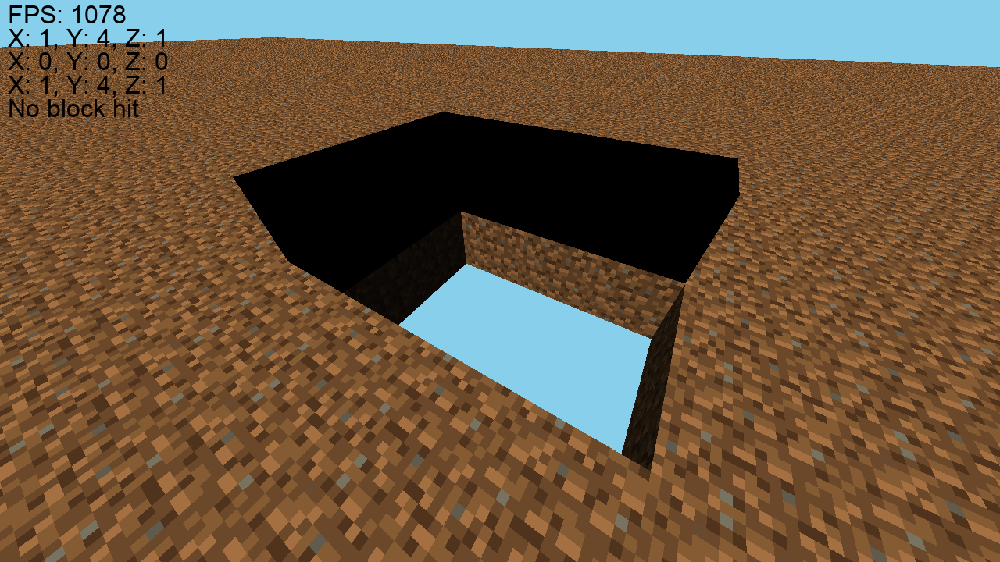
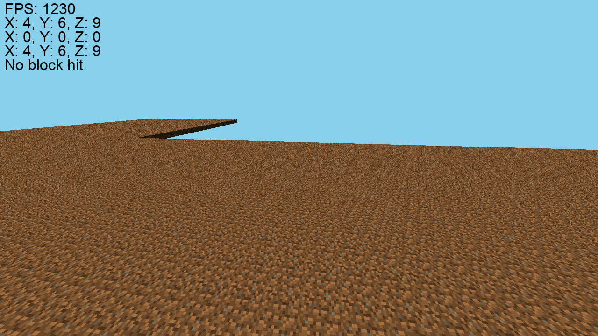
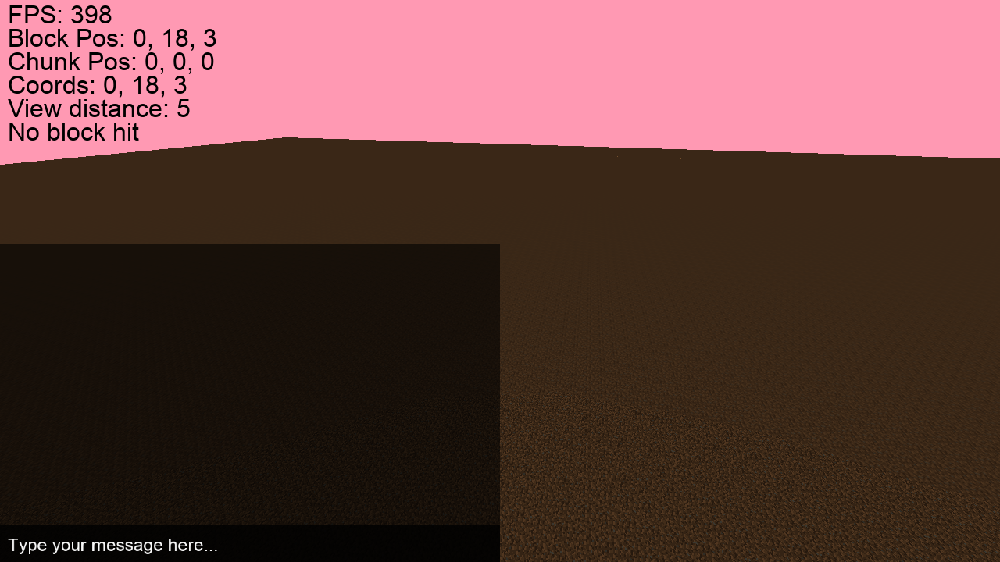

# 🛠️ MineOX — My Infinite Sandbox Game Inspired by Minecraft and Terraria

  

  
  
  
  
  
  
  

**MineOX** is my personal dream project: a true sandbox game with a limitless world.  
Taking inspiration from Minecraft and Terraria, I’m building a place where players can explore, build, and survive in an endless voxel universe that expands up, down, and in every direction.  
MineOX is more than code — it’s my own evolving game world.

---

## 🌍 Project Features

- Infinite World — chunk generation with no height or depth limits  
- Dynamic chunk loading with multi-threaded streaming  
- Custom block and texture system with easy extensibility  
- Optimized chunk memory management  
- Built with a custom architecture and engine, inspired by Minecraft and Terraria

---

## 📸 Screenshots

Here’s what MineOX looks like in action:

   
  <em>This is how the world looks for now.</em>

   
  <em>You can place and destroy the blocks.</em>

   
  <em>Infinite chunks and procedural terrain.</em>

   
  <em>UTF-8 chat support.</em>

---

## 📦 Initial Setup and Launch

To run MineOX, follow these simple steps:

-  Download this repository from GitHub.
-  Build the project using any C++ compiler you prefer.
-  Make sure the compiled .exe file is in the same directory as the data folder and all required libraries.

## 📂 Configuration and Data

On the first launch, MineOX will automatically create a hidden folder .mineox inside %APPDATA%:

(On Windows, %APPDATA% is usually C:\Users\<YourUserName>\AppData\Roaming.)

This folder will store all necessary files for the game to run properly — you don’t need to set up anything manually.

## 🎨 Customization

You can customize textures, fonts, and other resources in the data folder before launching.

Block textures must be .png files located in data\textures\blocks.

Each texture filename must exactly match the block’s stringRepresentation.

## ⚙️ OS Support

Note: MineOX currently works only on Windows.
Cross-platform support (Linux and macOS) is planned for the future.

The project uses:  
C++20, OpenGL, GLFW, GLAD, stb_image

✅ That’s it! Just run your .exe and MineOX will handle the rest.
No extra setup, no hassle — infinite world, right out of the box.

---

## 🔒 License

This project is licensed under a proprietary license.

**You may:**
- Download and view the source code
- Compile and run the project for personal use
- Modify the source code for personal, non-commercial experimentation

**You may not:**
- Publish or distribute the source code or your modifications
- Use the code or modifications in other projects or products
- Use the project for commercial purposes without permission

**Want to contribute?**
If you want to contribute your changes, please submit them for review. If approved, your contribution may be merged and you may be credited as a contributor.

See [LICENSE](./LICENSE) for details.

---

## 📬 Contact

Email: oximeracer@gmail.com  
GitHub: [https://github.com/Ox1mer](https://github.com/Ox1mer)
